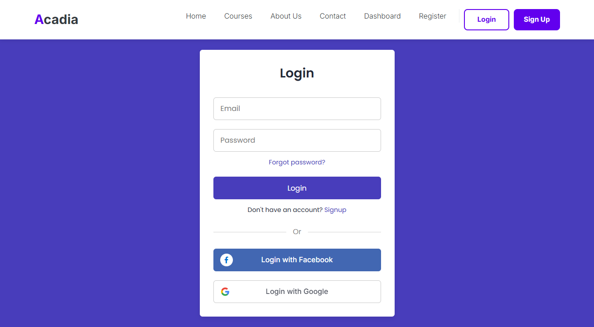
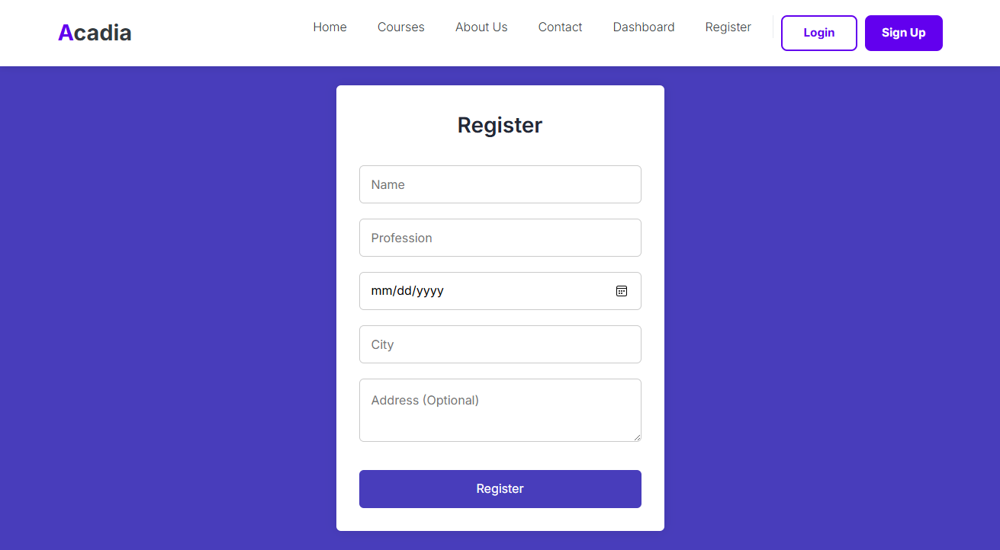
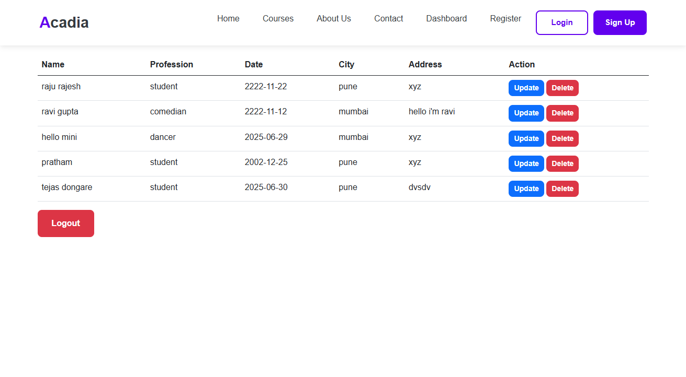
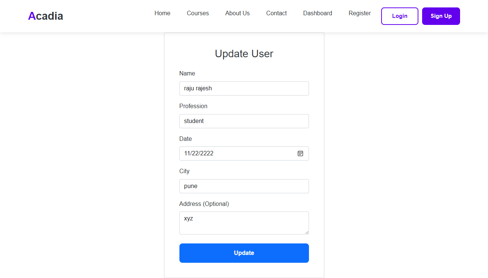

# usermanagement
code is uploaded in new branch

Online Course Enrollment System - Built a full-stack app with Spring Boot, ReactJS, and MySQL to manage course enrollments with role-based access for students and admins.

